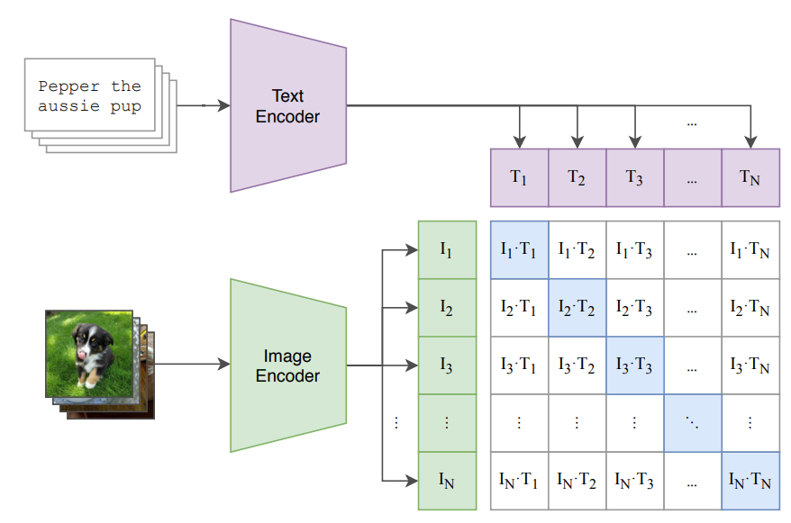
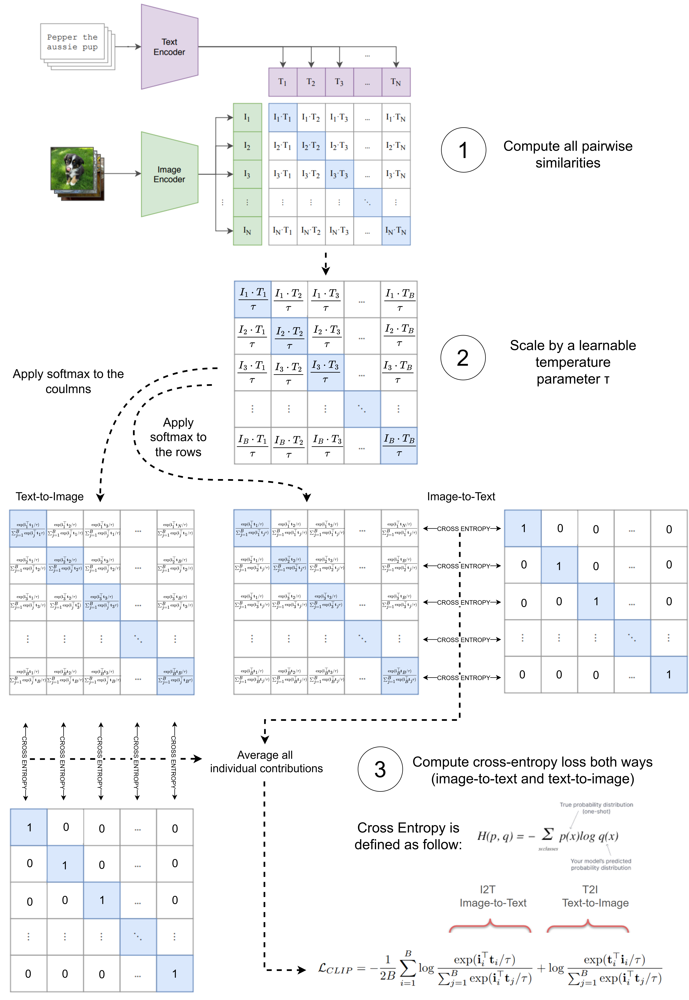
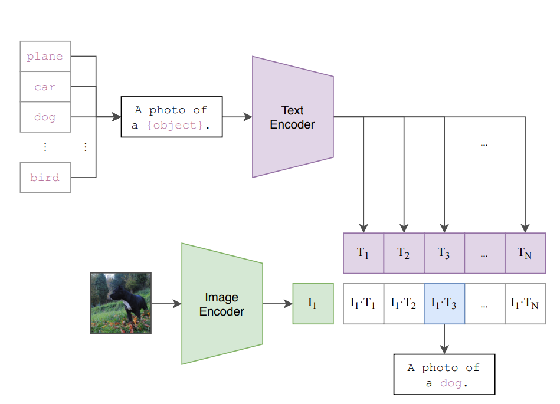
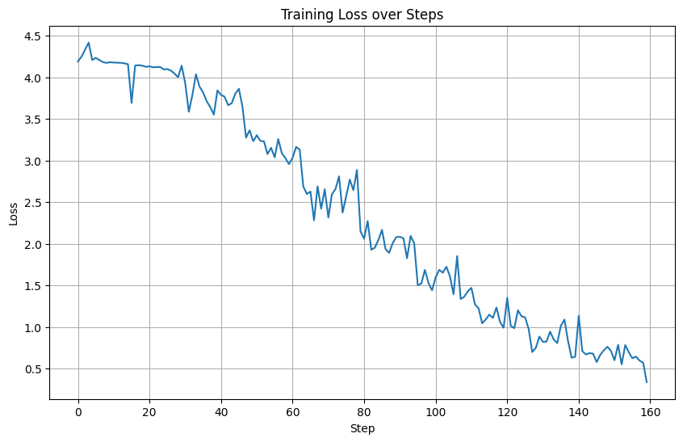
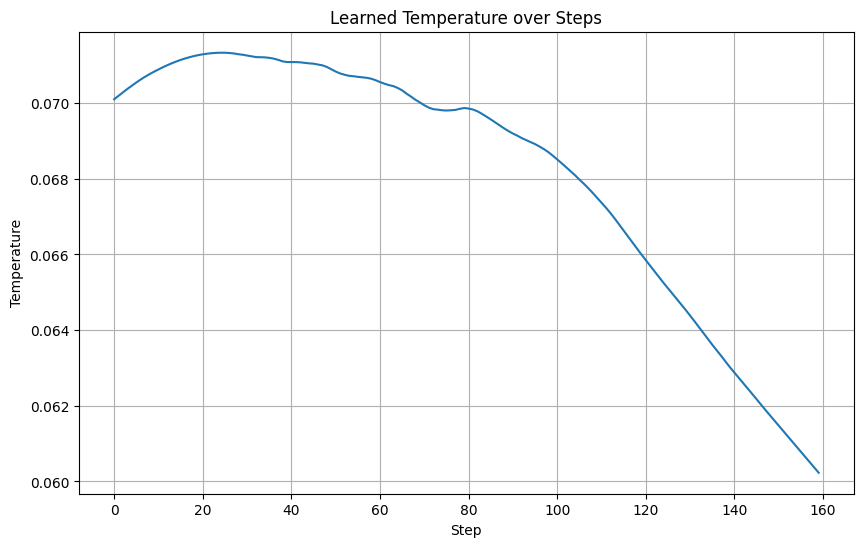

#  CLIP FUNDAMENTALS

### Topic: CLIP: Contrastive Language-Image Pretraining

### Author: [Giordano Cicchetti](https://giordano-cicchetti.github.io/)

This lab shows how to implement one of the most influential frameworks
of recent years in the field of multimodal learning: [CLIP (Radford et
al., 2021)](https://arxiv.org/abs/2103.00020).

Here is a summary of what this lab will cover:

1.  General theoretical introduction
2.  How to implement the CLIP loss function
3.  How to pretrain image and text encoders using the CLIP loss function
4.  How to evaluate the knowledge acquired by these models

**Suggested readings before starting**:

-   [CLIP Paper (Radford et al.,
    2021)](https://arxiv.org/abs/2103.00020)

``` python
!pip install open_clip_torch --quiet
import torch
import torch.nn as nn
import torch.nn.functional as F
from torchvision import transforms, datasets
from torch.utils.data import DataLoader
from tqdm import tqdm
import open_clip
from torchvision.datasets import CocoCaptions
from PIL import Image
```

## Section 1: Theoretical introduction

CLIP (Contrastive Language--Image Pretraining) is a framework introduced
by OpenAI that learns visual representations from natural language
supervision. It achieves strong zero-shot performance on a wide range of
image classification tasks.

### Key Ideas

-   Learn a **shared embedding space for text and images**. Where these
    two modalities are connected to each other by means of semantics
    meaning (i.e. the embedding of the image of a dog is \'close\' to
    the embedding of the text caption \"the photo of a dog\").
-   Use **contrastive loss** to align matching image-text pairs and
    separate non-matching ones.
-   Concepts of closeness and alignement expressed in terms of cosine
    **similarity**.
-   Enables **zero-shot classification** without task-specific
    fine-tuning.

### CLIP Architecture

CLIP is composed of two encoders:

-   **Image Encoder**: Typically ResNet-50 or ViT.
-   **Text Encoder**: Typically Transformer-based.

Both encoders project their inputs into a **shared embedding space**.
The latent dimension of such latent space is an hyperparameter that can
be choosed at design phase.

### CLIP Use Case

Main use: CLIP is used to pre-train text and visual models that can be
used/incorporated in downstram tasks.

Major examples are:

-   CLIP text encoder used as text conditioning module in
    text-to-content generation models \[1-2\];

-   CLIP image encoder used in Multimodal LLM to encode visual
    informations. \[3-4\]

\[1\] Ramesh, Aditya, et al. \"Hierarchical text-conditional image
generation with clip latents.\" arXiv preprint arXiv:2204.06125 1.2
(2022): 3.

\[2\] Liu, Haohe, et al. \"Audioldm: Text-to-audio generation with
latent diffusion models.\" International conference on machine learning.
PMLR, 2023.

\[3\] Liu, Haotian, et al. \"Visual instruction tuning.\" Advances in
neural information processing systems 36 NeurIPS (2023)

\[4\] Li, Junnan, et al. \"Blip-2: Bootstrapping language-image
pre-training with frozen image encoders and large language models.\"
International conference on machine learning. PMLR, 2023.

### Diagram



## Section 2: CLIP Loss Function

CLIP uses a symmetric cross-entropy loss based on cosine similarities.
This loss encourages matching image-text pairs to have similar
embeddings while pushing apart non-matching pairs.

Given a batch of N (image, text) pairs:

1.  Compute all pairwise similarities $S_{ij} = cosine(img_i, txt_j)$
2.  Scale by a learnable temperature parameter τ
3.  Compute cross-entropy loss both ways (image-to-text and
    text-to-image)

Mathematically:

$$
\mathcal{L}_{\mathrm{CLIP}}
= -\frac{1}{2B}
\sum_{i=1}^{B}
\Biggl[
  \underbrace{
    \log \frac{
      \exp\bigl(\langle \mathbf{I}_i, \mathbf{T}_i \rangle / \tau\bigr)
    }{
      \sum_{j=1}^{B} \exp\bigl(\langle \mathbf{I}_i, \mathbf{T}_j \rangle / \tau\bigr)
    }
  }_{\text{I2T: Image-to-Text}}
  \;+\;
  \underbrace{
    \log \frac{
      \exp\bigl(\langle \mathbf{T}_i, \mathbf{I}_i \rangle / \tau\bigr)
    }{
      \sum_{j=1}^{B} \exp\bigl(\langle \mathbf{T}_i, \mathbf{I}_j \rangle / \tau\bigr)
    }
  }_{\text{T2I: Text-to-Image}}
\Biggr]
$$

Let's break it down into parts and analyze each component to better
understand its behavior;

### 1) Compute all pairwise similarities 

$$\begin{equation} S_{ij} = cosine(img_i, txt_j) \end{equation}$$

The cosine similarity between two generic vectors $A$ and $B$ in the
same dimensional space $\mathbb{R}^d$, is defined as the cosine value of
the angle $\theta$ between them:

$$\begin{equation} cos(\theta)= \frac{\langle \mathbf{A}, \mathbf{B}
\rangle}{||\mathbf{A}|| ||\mathbf{B}||} \end{equation}$$

In the clip loss function the cosine similarity is present in the dot
products $$\begin{equation} \langle \textbf{I}_i, \textbf{T}_i
\rangle \end{equation}$$

The denominator?

-   $\mathbf{I}_i$ and $\mathbf{T}_i$ are extracted embeddings from the
    image and text encoder.
-   Key assumption of CLIP loss function is that $\mathbf{I}_i$ and
    $\mathbf{T}_i$ are vectors normalized to unitary norm. (i.e. we
    ALWAYS have to normalize embeddings coming out from encoders, unless
    explicitly defined)
-   The same subscript $_i$ tell us that they corresponds to paired
    content with the same semantic.

``` python
i = torch.randn(1,512) # Assume this is the output of the image encoder
t = torch.randn(1,512) # Assume this is the ouput of the text encoder

print(f"The shape of i vector is {i.shape}")
print(f"The shape of t vector is {t.shape}")
```


    The shape of i vector is torch.Size([1, 512]) 
    The shape of t vector is torch.Size([1, 512])


``` python
# Lets Check the norm of i and t
print(f"The norm of i is {i.norm()}")
print(f"The norm of t is {t.norm()}")
```


    The norm of i is 22.876724243164062
    The norm of t is 22.4530086517334


``` python
# Normalize to unitary norm
i = F.normalize(i, p=2, dim=1)
t = F.normalize(t, p=2, dim=1)

print(f"The norm of i is {i.norm():.2f}")
print(f"The norm of t is {t.norm():.2f}")
```


    The norm of i is 1.00
    The norm of t is 1.00


Now that we have unitary norm vectors, we can compute the cosine
similarity among them just with the dot product

``` python
cosine_similarity = i @ t.T # [1,512] @ [512,1] = [1,1]
print(f"The cosine similarity is {cosine_similarity.item():.2f}")
```

    The cosine similarity is -0.04


Working with batches

Assume you have a batch of N image-text pairs:

Images → encoded as vectors
$\mathbf{I}_1, \mathbf{I}_2, \cdots, \mathbf{I}_n$

Texts → encoded as vectors
$\mathbf{T}_1, \mathbf{T}_2, \cdots, \mathbf{T}_n$

CLIP computes cosine similarities among all image-text combinations in
the batch: $$\begin{equation} \mathbf{S}_{ ij} =
⟨\mathbf{I}_i,\mathbf{T}_j⟩ \end{equation}$$

$\mathbf{S}$ is a matrix of shape \[B, B\], containing similarity
scores.

``` python
B = 5

i = torch.randn(B,512) # Assume this is the output of the image encoder
t = torch.randn(B,512) # Assume this is the ouput of the text encoder

# Normalize to unitary norm
i = F.normalize(i, p=2, dim=1)
t = F.normalize(t, p=2, dim=1)

S = i @ t.T   #[B,512] @ [512,B] = [B,B]
print(f"The shape of S is {S.shape}")
print(f"The shape of S is: \n{S}")
```


    The shape of S is torch.Size([5, 5])
    The shape of S is: 
    tensor([[ 0.0347,  0.0375, -0.0328, -0.0253, -0.0745],
            [ 0.0179,  0.0866, -0.0741, -0.0032, -0.0220],
            [-0.0151,  0.0109, -0.0295,  0.0496,  0.0703],
            [-0.0272, -0.0400, -0.0184,  0.0262,  0.0691],
            [ 0.0432, -0.0579,  0.0218, -0.0007, -0.0053]])

### 2) Scale by a learnable temperature parameter τ 

$$
\begin{equation} \mathbf{S}_{ ij} =
\frac{⟨\mathbf{I}_i,\mathbf{T}_j⟩}{\tau} \end{equation}$$

Effects of Temperature on Model Behavior

1.  Lower Temperature ($\tau$ ↓)

-   **Sharper softmax distribution**: Emphasizes differences between
    positive and negative pairs.

-   **Focus on hard negatives**: The model pays more attention to
    challenging negative samples that are similar to the positive ones.

-   **Risk of over-separation**: May push apart semantically similar
    samples that shouldn\'t be separated, potentially harming
    generalization.

1.  Higher Temperature ($\tau$ ↑)

-   **Smoother softmax distribution**: Reduces emphasis on individual
    pair differences.

-   **Tolerance to similar negatives**: Allows semantically similar
    samples to remain closer in the embedding space.

-   **Risk of under-separation**: May not sufficiently distinguish
    between dissimilar samples, leading to less discriminative
    embeddings.

Practical Considerations

-   **Learnable τ**: CLIP often treats τ as a learnable parameter,
    allowing the model to find an optimal value during training.

-   **Dataset dependency**: Optimal τ may vary based on dataset
    characteristics, such as class balance and semantic diversity.

-   **Dynamic τ**: Some approaches adjust τ during training to balance
    the focus between hard negatives and overall embedding structure.

-   Typical temperature values range from 0.1 to 0.01. Temperature in
    the original CLIP paper: Learnable starting from 0.07

``` python
temperature = 0.07 #Define the temperature parameter

S_scaled = S / temperature

print(f"The shape of S_scaled is {S_scaled.shape}")
print(f"The shape of S_scaled is: \n{S_scaled}")
```

    The shape of S_scaled is torch.Size([5, 5])
    The shape of S_scaled is: 
    tensor([[ 0.4956,  0.5359, -0.4687, -0.3611, -1.0650],
            [ 0.2563,  1.2378, -1.0579, -0.0460, -0.3147],
            [-0.2156,  0.1557, -0.4212,  0.7079,  1.0038],
            [-0.3892, -0.5716, -0.2630,  0.3744,  0.9868],
            [ 0.6172, -0.8265,  0.3112, -0.0093, -0.0752]])


### 3) Compute cross-entropy loss both ways (image-to-text and text-to-image) 

``` python
# Targets: index of matching pairs
targets = torch.arange(B) # [0,1,2,3....,B]

# Cross-entropy losses
loss_i2t = F.cross_entropy(S_scaled, targets)        # Image to text
loss_t2i = F.cross_entropy(S_scaled.T, targets)      # Text to image

# Final CLIP loss
loss = (loss_i2t + loss_t2i) / 2
print(f"The final CLIP loss is {loss.item():.2f}")
```



### Code

``` python
class ClipLoss(nn.Module):
    def __init__(self, temperature=0.07):
        super().__init__()
        # Let the temperature be a learnable parameter
        self.temperature = nn.Parameter(torch.tensor(temperature))
        # Otherwise
        # self.temperature = torch.tensor(temperature)

    def forward(self, image_features, text_features):
        # image features: [B,D]
        # text features: [B,D]

        # Normalize
        image_features = F.normalize(image_features, dim=1)
        text_features = F.normalize(text_features, dim=1)

        # Similarity matrix and temperature scaling
        logits_per_image = image_features @ text_features.t() / self.temperature
        logits_per_text = text_features @ image_features.t() / self.temperature

        batch_size = image_features.size(0)
        labels = torch.arange(batch_size).to(image_features.device)

        loss_i2t = F.cross_entropy(logits_per_image, labels)
        loss_t2i = F.cross_entropy(logits_per_text, labels)

        return (loss_i2t + loss_t2i) / 2
```

## Section 3: Training session

### Load Mini-Coco Dataset

Handmade dataset from MSCOCO <https://cocodataset.org/#home>

1000 Image-Text pairs for training 100 Image-Text pairs for testing

Just for fun :)

``` python
!gdown 1ld44JrobUwxlSnLEncdXIqX2tCeZA-fd

!unzip /content/mini_coco.zip
```

Retrieval tasks:

-   Image-to-Text Retrieval (Image → Text):

    Given an image as a query, the goal is to retrieve the most relevant
    textual descriptions (captions) from a collection. This is useful in
    applications like automatic image captioning or image search engines
    that return text results.

-   Text-to-Image Retrieval (Text → Image):

    Given a text query (e.g., a sentence or phrase), the goal is to
    retrieve the most relevant images from a dataset. This is common in
    systems like search engines or content recommendation platforms
    where users describe what they want to see.




``` python
def compute_retrieval_metrics(x: torch.Tensor):

    sx, _ = torch.sort(-x, dim=1)
    d = torch.diagonal(-x)


    d = d.unsqueeze(1)  # Make it (N, 1)
    ind_matrix = sx - d
    matches = (ind_matrix == 0)
    ind = matches.float().argmax(dim=1)

    metrics = {
        'R1': float((ind == 0).sum().item()) * 100 / len(ind),
        'R5': float((ind < 5).sum().item()) * 100 / len(ind),
        'R10': float((ind < 10).sum().item()) * 100 / len(ind),
    }
    return metrics
```

Training and Validation pipeline

``` python
# --- CONFIG ---
BATCH_SIZE = 64
NUM_EPOCHS = 10
DEVICE = "cuda" if torch.cuda.is_available() else "cpu"
MODEL_NAME = "RN50"
PRETRAINED = None  # Start from scratch

# --- DATASET ---
transform = transforms.Compose([
    transforms.Resize((224, 224)),
    transforms.ToTensor(),
    transforms.Normalize((0.48145466, 0.4578275, 0.40821073),
                         (0.26862954, 0.26130258, 0.27577711)),
])


train_dataset = CocoCaptions(
    root='./mini_coco/train2017',
    annFile='./mini_coco/annotations/captions_train2017.json',
    transform=transform
)

val_dataset =  CocoCaptions(
    root='./mini_coco/val2017',
    annFile='./mini_coco/annotations/captions_val2017.json',
    transform=transform
)
def collate_fn(batch):
    images, captions = zip(*batch)
    images = torch.stack(images)
    texts = [cap[0] for cap in captions]  # use the first caption
    return images, texts

train_loader = DataLoader(train_dataset, batch_size=BATCH_SIZE, shuffle=True,
                        collate_fn=collate_fn, num_workers=4)

val_loader = DataLoader(val_dataset, batch_size=BATCH_SIZE, shuffle=False,
                        collate_fn=collate_fn, num_workers=4)

# --- MODEL ---
model, _, preprocess = open_clip.create_model_and_transforms(MODEL_NAME, pretrained=PRETRAINED)
tokenizer = open_clip.get_tokenizer(MODEL_NAME)
model = model.to(DEVICE)
loss_fn = ClipLoss(temperature=0.07)

# --- TRAINING ---
optimizer = torch.optim.Adam([x for x in model.parameters()]+[x for x in loss_fn.parameters()], lr=1e-4)

# --- TRACK FOR PLOT ---
loss_values = []
temperature_values = []


# --- TRAIN + VALIDATION ---
for epoch in range(NUM_EPOCHS):
    model.train()
    total_loss = 0

    for images, texts in tqdm(train_loader, desc=f"Epoch {epoch+1} [Training]"):
        images = images.to(DEVICE)
        texts = tokenizer(texts).to(DEVICE)

        image_features = model.encode_image(images)
        text_features = model.encode_text(texts)

        loss = loss_fn(image_features, text_features)

        optimizer.zero_grad()
        loss.backward()
        optimizer.step()

        total_loss += loss.item()
        loss_values.append(loss.item())
        temperature_values.append(loss_fn.temperature.item())

    avg_loss = total_loss / len(train_loader)
    print(f"Epoch {epoch+1} — Training Loss: {avg_loss:.4f}")

    # --- VALIDATION ---
    model.eval()
    with torch.no_grad():
        all_image_features = []
        all_text_features = []

        for images, texts in tqdm(val_loader, desc=f"Epoch {epoch+1} [Validation]"):
            images = images.to(DEVICE)
            texts = tokenizer(texts).to(DEVICE)

            image_feats = F.normalize(model.encode_image(images), dim=-1)
            text_feats = F.normalize(model.encode_text(texts), dim=-1)

            all_image_features.append(image_feats)
            all_text_features.append(text_feats)

        image_features = torch.cat(all_image_features, dim=0)
        text_features = torch.cat(all_text_features, dim=0)

        similarity = image_features @ text_features.T

        metrics_i2t = compute_retrieval_metrics(similarity)
        print(f"Validation Accuracy — Image→Text: R1 {metrics_i2t['R1']:.4f}, R5 {metrics_i2t['R5']:.4f}, R10 {metrics_i2t['R10']:.4f}")

        metrics_t2i = compute_retrieval_metrics(similarity.T)
        print(f"Validation Accuracy — Text→Image: R1 {metrics_t2i['R1']:.4f}, R5 {metrics_t2i['R5']:.4f}, R10 {metrics_t2i['R10']:.4f}")

```

    Epoch 1 [Training]: 100%|██████████| 16/16 [00:21<00:00,  1.33s/it]

    Epoch 1 — Training Loss: 4.1814

    Epoch 1 [Validation]: 100%|██████████| 2/2 [00:01<00:00,  1.18it/s]
    Validation Accuracy — Image→Text: R1 1.0000, R5 5.0000, R10 12.0000
    Validation Accuracy — Text→Image: R1 1.0000, R5 5.0000, R10 11.0000

    Epoch 2 [Training]: 100%|██████████| 16/16 [00:19<00:00,  1.20s/it]

    Epoch 2 — Training Loss: 4.0629

    Epoch 2 [Validation]: 100%|██████████| 2/2 [00:01<00:00,  1.25it/s]

    Validation Accuracy — Image→Text: R1 3.0000, R5 6.0000, R10 15.0000
    Validation Accuracy — Text→Image: R1 1.0000, R5 5.0000, R10 14.0000

    Epoch 3 [Training]: 100%|██████████| 16/16 [00:19<00:00,  1.22s/it]

    Epoch 3 — Training Loss: 3.7348

    Epoch 3 [Validation]: 100%|██████████| 2/2 [00:01<00:00,  1.20it/s]

    Validation Accuracy — Image→Text: R1 5.0000, R5 13.0000, R10 25.0000
    Validation Accuracy — Text→Image: R1 3.0000, R5 12.0000, R10 21.0000

    Epoch 4 [Training]: 100%|██████████| 16/16 [00:20<00:00,  1.27s/it]

    Epoch 4 — Training Loss: 3.1225

    Epoch 4 [Validation]: 100%|██████████| 2/2 [00:01<00:00,  1.25it/s]

    Validation Accuracy — Image→Text: R1 3.0000, R5 11.0000, R10 21.0000
    Validation Accuracy — Text→Image: R1 4.0000, R5 12.0000, R10 18.0000

    Epoch 5 [Training]: 100%|██████████| 16/16 [00:20<00:00,  1.26s/it]

    Epoch 5 — Training Loss: 2.5640

    Epoch 5 [Validation]: 100%|██████████| 2/2 [00:01<00:00,  1.25it/s]

    Validation Accuracy — Image→Text: R1 3.0000, R5 14.0000, R10 27.0000
    Validation Accuracy — Text→Image: R1 1.0000, R5 13.0000, R10 26.0000

    Epoch 6 [Training]: 100%|██████████| 16/16 [00:20<00:00,  1.25s/it]

    Epoch 6 — Training Loss: 1.9938

    Epoch 6 [Validation]: 100%|██████████| 2/2 [00:01<00:00,  1.04it/s]

    Validation Accuracy — Image→Text: R1 5.0000, R5 12.0000, R10 17.0000
    Validation Accuracy — Text→Image: R1 3.0000, R5 11.0000, R10 18.0000

    Epoch 7 [Training]: 100%|██████████| 16/16 [00:20<00:00,  1.29s/it]

    Epoch 7 — Training Loss: 1.5335

    Epoch 7 [Validation]: 100%|██████████| 2/2 [00:01<00:00,  1.27it/s]

    Validation Accuracy — Image→Text: R1 6.0000, R5 18.0000, R10 25.0000
    Validation Accuracy — Text→Image: R1 2.0000, R5 13.0000, R10 26.0000

    Epoch 8 [Training]: 100%|██████████| 16/16 [00:20<00:00,  1.30s/it]

    Epoch 8 — Training Loss: 1.0845

    Epoch 8 [Validation]: 100%|██████████| 2/2 [00:01<00:00,  1.25it/s]

    Validation Accuracy — Image→Text: R1 4.0000, R5 16.0000, R10 26.0000
    Validation Accuracy — Text→Image: R1 5.0000, R5 17.0000, R10 27.0000

    Epoch 9 [Training]: 100%|██████████| 16/16 [00:20<00:00,  1.28s/it]

    Epoch 9 — Training Loss: 0.8292

    Epoch 9 [Validation]: 100%|██████████| 2/2 [00:01<00:00,  1.12it/s]

    Validation Accuracy — Image→Text: R1 4.0000, R5 17.0000, R10 28.0000
    Validation Accuracy — Text→Image: R1 1.0000, R5 16.0000, R10 24.0000

    Epoch 10 [Training]: 100%|██████████| 16/16 [00:20<00:00,  1.27s/it]

    Epoch 10 — Training Loss: 0.6429

    Epoch 10 [Validation]: 100%|██████████| 2/2 [00:01<00:00,  1.25it/s]

    Validation Accuracy — Image→Text: R1 6.0000, R5 17.0000, R10 28.0000
    Validation Accuracy — Text→Image: R1 4.0000, R5 20.0000, R10 26.0000

``` python
# Plot all the values inside loss_values array and temperature_values

import matplotlib.pyplot as plt

plt.figure(figsize=(10, 6))
plt.plot(loss_values)
plt.title('Training Loss over Steps')
plt.xlabel('Step')
plt.ylabel('Loss')
plt.grid(True)
plt.show()

plt.figure(figsize=(10, 6))
plt.plot(temperature_values)
plt.title('Learned Temperature over Steps')
plt.xlabel('Step')
plt.ylabel('Temperature')
plt.grid(True)
plt.show()
```



## Section 4: Validation session

[OpenCLIP library](https://github.com/mlfoundations/open_clip), is an
open source reimplementation of OpenAI's CLIP (Contrastive
Language-Image Pre-training) model. It provides a flexible and scalable
codebase that allows researchers and developers to train, fine-tune, and
deploy CLIP models on various datasets and hardware configurations.

``` python
import open_clip

available_models = open_clip.list_pretrained()

for model_name, pretrained_dataset in available_models:
    print(f"Model: {model_name}, Pretrained on: {pretrained_dataset}")
```

    Model: RN50, Pretrained on: openai
    Model: RN50, Pretrained on: yfcc15m
    Model: RN50, Pretrained on: cc12m
    Model: RN101, Pretrained on: openai
    Model: RN101, Pretrained on: yfcc15m
    Model: RN50x4, Pretrained on: openai
    Model: RN50x16, Pretrained on: openai
    Model: RN50x64, Pretrained on: openai
    Model: ViT-B-32, Pretrained on: openai
    Model: ViT-B-32, Pretrained on: laion400m_e31
    Model: ViT-B-32, Pretrained on: laion400m_e32
    Model: ViT-B-32, Pretrained on: laion2b_e16
    Model: ViT-B-32, Pretrained on: laion2b_s34b_b79k
    Model: ViT-B-32, Pretrained on: datacomp_xl_s13b_b90k
    Model: ViT-B-32, Pretrained on: datacomp_m_s128m_b4k
    Model: ViT-B-32, Pretrained on: commonpool_m_clip_s128m_b4k
    Model: ViT-B-32, Pretrained on: commonpool_m_laion_s128m_b4k
    Model: ViT-B-32, Pretrained on: commonpool_m_image_s128m_b4k
    Model: ViT-B-32, Pretrained on: commonpool_m_text_s128m_b4k
    Model: ViT-B-32, Pretrained on: commonpool_m_basic_s128m_b4k
    Model: ViT-B-32, Pretrained on: commonpool_m_s128m_b4k
    Model: ViT-B-32, Pretrained on: datacomp_s_s13m_b4k
    Model: ViT-B-32, Pretrained on: commonpool_s_clip_s13m_b4k
    Model: ViT-B-32, Pretrained on: commonpool_s_laion_s13m_b4k
    Model: ViT-B-32, Pretrained on: commonpool_s_image_s13m_b4k
    Model: ViT-B-32, Pretrained on: commonpool_s_text_s13m_b4k
    Model: ViT-B-32, Pretrained on: commonpool_s_basic_s13m_b4k
    Model: ViT-B-32, Pretrained on: commonpool_s_s13m_b4k
    Model: ViT-B-32, Pretrained on: metaclip_400m
    Model: ViT-B-32, Pretrained on: metaclip_fullcc
    Model: ViT-B-32-256, Pretrained on: datacomp_s34b_b86k
    Model: ViT-B-16, Pretrained on: openai
    Model: ViT-B-16, Pretrained on: laion400m_e31
    Model: ViT-B-16, Pretrained on: laion400m_e32
    Model: ViT-B-16, Pretrained on: laion2b_s34b_b88k
    Model: ViT-B-16, Pretrained on: datacomp_xl_s13b_b90k
    Model: ViT-B-16, Pretrained on: datacomp_l_s1b_b8k
    Model: ViT-B-16, Pretrained on: commonpool_l_clip_s1b_b8k
    Model: ViT-B-16, Pretrained on: commonpool_l_laion_s1b_b8k
    Model: ViT-B-16, Pretrained on: commonpool_l_image_s1b_b8k
    Model: ViT-B-16, Pretrained on: commonpool_l_text_s1b_b8k
    Model: ViT-B-16, Pretrained on: commonpool_l_basic_s1b_b8k
    Model: ViT-B-16, Pretrained on: commonpool_l_s1b_b8k
    Model: ViT-B-16, Pretrained on: dfn2b
    Model: ViT-B-16, Pretrained on: metaclip_400m
    Model: ViT-B-16, Pretrained on: metaclip_fullcc
    Model: ViT-B-16-plus-240, Pretrained on: laion400m_e31
    Model: ViT-B-16-plus-240, Pretrained on: laion400m_e32
    Model: ViT-L-14, Pretrained on: openai
    Model: ViT-L-14, Pretrained on: laion400m_e31
    Model: ViT-L-14, Pretrained on: laion400m_e32
    Model: ViT-L-14, Pretrained on: laion2b_s32b_b82k
    Model: ViT-L-14, Pretrained on: datacomp_xl_s13b_b90k
    Model: ViT-L-14, Pretrained on: commonpool_xl_clip_s13b_b90k
    Model: ViT-L-14, Pretrained on: commonpool_xl_laion_s13b_b90k
    Model: ViT-L-14, Pretrained on: commonpool_xl_s13b_b90k
    Model: ViT-L-14, Pretrained on: metaclip_400m
    Model: ViT-L-14, Pretrained on: metaclip_fullcc
    Model: ViT-L-14, Pretrained on: dfn2b
    Model: ViT-L-14, Pretrained on: dfn2b_s39b
    Model: ViT-L-14-336, Pretrained on: openai
    Model: ViT-H-14, Pretrained on: laion2b_s32b_b79k
    Model: ViT-H-14, Pretrained on: metaclip_fullcc
    Model: ViT-H-14, Pretrained on: metaclip_altogether
    Model: ViT-H-14, Pretrained on: dfn5b
    Model: ViT-H-14-378, Pretrained on: dfn5b
    Model: ViT-g-14, Pretrained on: laion2b_s12b_b42k
    Model: ViT-g-14, Pretrained on: laion2b_s34b_b88k
    Model: ViT-bigG-14, Pretrained on: laion2b_s39b_b160k
    Model: ViT-bigG-14, Pretrained on: metaclip_fullcc
    Model: roberta-ViT-B-32, Pretrained on: laion2b_s12b_b32k
    Model: xlm-roberta-base-ViT-B-32, Pretrained on: laion5b_s13b_b90k
    Model: xlm-roberta-large-ViT-H-14, Pretrained on: frozen_laion5b_s13b_b90k
    Model: convnext_base, Pretrained on: laion400m_s13b_b51k
    Model: convnext_base_w, Pretrained on: laion2b_s13b_b82k
    Model: convnext_base_w, Pretrained on: laion2b_s13b_b82k_augreg
    Model: convnext_base_w, Pretrained on: laion_aesthetic_s13b_b82k
    Model: convnext_base_w_320, Pretrained on: laion_aesthetic_s13b_b82k
    Model: convnext_base_w_320, Pretrained on: laion_aesthetic_s13b_b82k_augreg
    Model: convnext_large_d, Pretrained on: laion2b_s26b_b102k_augreg
    Model: convnext_large_d_320, Pretrained on: laion2b_s29b_b131k_ft
    Model: convnext_large_d_320, Pretrained on: laion2b_s29b_b131k_ft_soup
    Model: convnext_xxlarge, Pretrained on: laion2b_s34b_b82k_augreg
    Model: convnext_xxlarge, Pretrained on: laion2b_s34b_b82k_augreg_rewind
    Model: convnext_xxlarge, Pretrained on: laion2b_s34b_b82k_augreg_soup
    Model: coca_ViT-B-32, Pretrained on: laion2b_s13b_b90k
    Model: coca_ViT-B-32, Pretrained on: mscoco_finetuned_laion2b_s13b_b90k
    Model: coca_ViT-L-14, Pretrained on: laion2b_s13b_b90k
    Model: coca_ViT-L-14, Pretrained on: mscoco_finetuned_laion2b_s13b_b90k
    Model: EVA01-g-14, Pretrained on: laion400m_s11b_b41k
    Model: EVA01-g-14-plus, Pretrained on: merged2b_s11b_b114k
    Model: EVA02-B-16, Pretrained on: merged2b_s8b_b131k
    Model: EVA02-L-14, Pretrained on: merged2b_s4b_b131k
    Model: EVA02-L-14-336, Pretrained on: merged2b_s6b_b61k
    Model: EVA02-E-14, Pretrained on: laion2b_s4b_b115k
    Model: EVA02-E-14-plus, Pretrained on: laion2b_s9b_b144k
    Model: ViT-B-16-SigLIP, Pretrained on: webli
    Model: ViT-B-16-SigLIP-256, Pretrained on: webli
    Model: ViT-B-16-SigLIP-i18n-256, Pretrained on: webli
    Model: ViT-B-16-SigLIP-384, Pretrained on: webli
    Model: ViT-B-16-SigLIP-512, Pretrained on: webli
    Model: ViT-L-16-SigLIP-256, Pretrained on: webli
    Model: ViT-L-16-SigLIP-384, Pretrained on: webli
    Model: ViT-SO400M-14-SigLIP, Pretrained on: webli
    Model: ViT-SO400M-16-SigLIP-i18n-256, Pretrained on: webli
    Model: ViT-SO400M-14-SigLIP-378, Pretrained on: webli
    Model: ViT-SO400M-14-SigLIP-384, Pretrained on: webli
    Model: ViT-B-32-SigLIP2-256, Pretrained on: webli
    Model: ViT-B-16-SigLIP2, Pretrained on: webli
    Model: ViT-B-16-SigLIP2-256, Pretrained on: webli
    Model: ViT-B-16-SigLIP2-384, Pretrained on: webli
    Model: ViT-B-16-SigLIP2-512, Pretrained on: webli
    Model: ViT-L-16-SigLIP2-256, Pretrained on: webli
    Model: ViT-L-16-SigLIP2-384, Pretrained on: webli
    Model: ViT-L-16-SigLIP2-512, Pretrained on: webli
    Model: ViT-SO400M-14-SigLIP2, Pretrained on: webli
    Model: ViT-SO400M-14-SigLIP2-378, Pretrained on: webli
    Model: ViT-SO400M-16-SigLIP2-256, Pretrained on: webli
    Model: ViT-SO400M-16-SigLIP2-384, Pretrained on: webli
    Model: ViT-SO400M-16-SigLIP2-512, Pretrained on: webli
    Model: ViT-gopt-16-SigLIP2-256, Pretrained on: webli
    Model: ViT-gopt-16-SigLIP2-384, Pretrained on: webli
    Model: ViT-L-14-CLIPA, Pretrained on: datacomp1b
    Model: ViT-L-14-CLIPA-336, Pretrained on: datacomp1b
    Model: ViT-H-14-CLIPA, Pretrained on: datacomp1b
    Model: ViT-H-14-CLIPA-336, Pretrained on: laion2b
    Model: ViT-H-14-CLIPA-336, Pretrained on: datacomp1b
    Model: ViT-bigG-14-CLIPA, Pretrained on: datacomp1b
    Model: ViT-bigG-14-CLIPA-336, Pretrained on: datacomp1b
    Model: nllb-clip-base, Pretrained on: v1
    Model: nllb-clip-large, Pretrained on: v1
    Model: nllb-clip-base-siglip, Pretrained on: v1
    Model: nllb-clip-base-siglip, Pretrained on: mrl
    Model: nllb-clip-large-siglip, Pretrained on: v1
    Model: nllb-clip-large-siglip, Pretrained on: mrl
    Model: MobileCLIP-S1, Pretrained on: datacompdr
    Model: MobileCLIP-S2, Pretrained on: datacompdr
    Model: MobileCLIP-B, Pretrained on: datacompdr
    Model: MobileCLIP-B, Pretrained on: datacompdr_lt
    Model: ViTamin-S, Pretrained on: datacomp1b
    Model: ViTamin-S-LTT, Pretrained on: datacomp1b
    Model: ViTamin-B, Pretrained on: datacomp1b
    Model: ViTamin-B-LTT, Pretrained on: datacomp1b
    Model: ViTamin-L, Pretrained on: datacomp1b
    Model: ViTamin-L-256, Pretrained on: datacomp1b
    Model: ViTamin-L-336, Pretrained on: datacomp1b
    Model: ViTamin-L-384, Pretrained on: datacomp1b
    Model: ViTamin-L2, Pretrained on: datacomp1b
    Model: ViTamin-L2-256, Pretrained on: datacomp1b
    Model: ViTamin-L2-336, Pretrained on: datacomp1b
    Model: ViTamin-L2-384, Pretrained on: datacomp1b
    Model: ViTamin-XL-256, Pretrained on: datacomp1b
    Model: ViTamin-XL-336, Pretrained on: datacomp1b
    Model: ViTamin-XL-384, Pretrained on: datacomp1b
    Model: RN50-quickgelu, Pretrained on: openai
    Model: RN50-quickgelu, Pretrained on: yfcc15m
    Model: RN50-quickgelu, Pretrained on: cc12m
    Model: RN101-quickgelu, Pretrained on: openai
    Model: RN101-quickgelu, Pretrained on: yfcc15m
    Model: RN50x4-quickgelu, Pretrained on: openai
    Model: RN50x16-quickgelu, Pretrained on: openai
    Model: RN50x64-quickgelu, Pretrained on: openai
    Model: ViT-B-32-quickgelu, Pretrained on: openai
    Model: ViT-B-32-quickgelu, Pretrained on: laion400m_e31
    Model: ViT-B-32-quickgelu, Pretrained on: laion400m_e32
    Model: ViT-B-32-quickgelu, Pretrained on: metaclip_400m
    Model: ViT-B-32-quickgelu, Pretrained on: metaclip_fullcc
    Model: ViT-B-16-quickgelu, Pretrained on: openai
    Model: ViT-B-16-quickgelu, Pretrained on: dfn2b
    Model: ViT-B-16-quickgelu, Pretrained on: metaclip_400m
    Model: ViT-B-16-quickgelu, Pretrained on: metaclip_fullcc
    Model: ViT-L-14-quickgelu, Pretrained on: openai
    Model: ViT-L-14-quickgelu, Pretrained on: metaclip_400m
    Model: ViT-L-14-quickgelu, Pretrained on: metaclip_fullcc
    Model: ViT-L-14-quickgelu, Pretrained on: dfn2b
    Model: ViT-L-14-336-quickgelu, Pretrained on: openai
    Model: ViT-H-14-quickgelu, Pretrained on: metaclip_fullcc
    Model: ViT-H-14-quickgelu, Pretrained on: dfn5b
    Model: ViT-H-14-378-quickgelu, Pretrained on: dfn5b
    Model: ViT-bigG-14-quickgelu, Pretrained on: metaclip_fullcc

Check out here:

<https://github.com/mlfoundations/open_clip/blob/main/docs/openclip_retrieval_results.csv>

<https://github.com/mlfoundations/open_clip/blob/main/docs/openclip_classification_results.csv>


Load a pretrained model from OpenCLIP:

``` python

model_name = 'ViT-SO400M-14-SigLIP-384'
model_pretrained, _, preprocess = open_clip.create_model_and_transforms(
    model_name, pretrained='webli'
)
tokenizer = open_clip.get_tokenizer(model_name)
model_pretrained = model_pretrained.to(DEVICE).eval()
```


Evaluate the performance of pretrained model on the vanilla provided
test dataset:

``` python
# --- DATASET ---

val_dataset =  CocoCaptions(
    root='./mini_coco/val2017',
    annFile='./mini_coco/annotations/captions_val2017.json',
    transform=preprocess)


val_loader = DataLoader(val_dataset, batch_size=BATCH_SIZE, shuffle=False,
                        collate_fn=collate_fn, num_workers=4)

# --- VALIDATION ---
model_pretrained.eval()
with torch.no_grad():
    all_image_features = []
    all_text_features = []

    for images, texts in tqdm(val_loader, desc=f"[Validation]"):
        images = images.to(DEVICE)
        texts = tokenizer(texts).to(DEVICE)

        image_feats = F.normalize(model_pretrained.encode_image(images), dim=-1)
        text_feats = F.normalize(model_pretrained.encode_text(texts), dim=-1)

        all_image_features.append(image_feats)
        all_text_features.append(text_feats)

    image_features = torch.cat(all_image_features, dim=0)
    text_features = torch.cat(all_text_features, dim=0)
    similarity = image_features @ text_features.T

    metrics_i2t = compute_retrieval_metrics(similarity)
    print(f"Validation Accuracy — Image→Text: R1 {metrics_i2t['R1']:.2f}, R5 {metrics_i2t['R5']:.2f}, R10 {metrics_i2t['R10']:.2f}")
    metrics_t2i = compute_retrieval_metrics(similarity.T)
    print(f"Validation Accuracy — Text→Image: R1 {metrics_t2i['R1']:.2f}, R5 {metrics_t2i['R5']:.2f}, R10 {metrics_t2i['R10']:.2f}")
```

    [Validation]: 100%|██████████| 2/2 [00:15<00:00,  7.70s/it]

    Validation Accuracy — Image→Text: R1 92.00, R5 100.00, R10 100.00
    Validation Accuracy — Text→Image: R1 88.00, R5 99.00, R10 100.00


Feel free to test different pretrained models.


## Section 5: Zero-Shot Image Classification

In this section we will test the ability of CLIP pretrained encoders in
a typical downstream task: **Zero-Shot Image Classification**.

CIFAR10 test dataset could be used for this purpose. It contains 10k
test images with 10 testing labels: \"airplane\", \"automobile\",
\"bird\", \"cat\", \"deer\", \"dog\", \"frog\", \"horse\", \"ship\" and
\"truck\"

Load the CLIP pretrained encoders (we know how to do it).

``` python
# Load the model and preprocessing
model_name = "ViT-B-32"
pretrained = "openai"
device = "cuda" if torch.cuda.is_available() else "cpu"

model_pretrained, _, preprocess = open_clip.create_model_and_transforms(model_name, pretrained=pretrained)
tokenizer = open_clip.get_tokenizer(model_name)
model_pretrained = model_pretrained.to(device).eval()
```


Load the test dataset.

``` python
from torchvision.datasets import CIFAR10
# Load CIFAR-10 test set
cifar10_labels = [
    "airplane", "automobile", "bird", "cat", "deer",
    "dog", "frog", "horse", "ship", "truck"
]
transform = preprocess  # Use OpenCLIP's default preprocess
testset = CIFAR10(root="./data", train=False, download=True, transform=transform)
testloader = DataLoader(testset, batch_size=16, shuffle=False)
```

Extract Text Embeddings, one for each label.

``` python
# Tokenize class names and extract embeddings
text_inputs = tokenizer([f"a photo of a {label}" for label in cifar10_labels]).to(device)
with torch.no_grad():
    text_features = model_pretrained.encode_text(text_inputs)
    text_features = F.normalize(text_features, dim=-1)
```

Extract all the image embeddings and for each image embedding compute
the cosine similarity score between itself and all the text embeddings.
The predicted label for a given input image will be the item with the
highest similarity score.


``` python
# Classify each sample in the test set
all_preds = []
all_targets = []
with torch.no_grad():
    for images, targets in tqdm(testloader):
        images = images.to(device)
        image_features = model.encode_image(images)
        image_features /= image_features.norm(dim=-1, keepdim=True)

        logits = image_features @ text_features.T
        preds = torch.argmax(logits, dim=1)

        all_preds.extend(preds.cpu().numpy())
        all_targets.extend(targets.cpu().numpy())
```

Compute classification metrics

``` python
from sklearn.metrics import classification_report, accuracy_score

acc = accuracy_score(all_targets, all_preds)
report = classification_report(all_targets, all_preds, target_names=cifar10_labels, digits=4)

print(f"\n Zero-Shot Image Classification Accuracy on CIFAR-10: {acc*100:.2f}%")
print("\n Detailed Classification Report:\n")
print(report)
```


     Zero-Shot Image Classification Accuracy on CIFAR-10: 86.17%

     Detailed Classification Report:

                  precision    recall  f1-score   support

        airplane     0.9807    0.8110    0.8878      1000
      automobile     0.9768    0.8420    0.9044      1000
            bird     0.7494    0.8730    0.8065      1000
             cat     0.8565    0.7340    0.7905      1000
            deer     0.8070    0.8570    0.8312      1000
             dog     0.8138    0.8740    0.8428      1000
            frog     0.9529    0.7080    0.8124      1000
           horse     0.8140    0.9670    0.8839      1000
            ship     0.9179    0.9730    0.9447      1000
           truck     0.8417    0.9780    0.9047      1000

        accuracy                         0.8617     10000
       macro avg     0.8710    0.8617    0.8609     10000
    weighted avg     0.8710    0.8617    0.8609     10000
